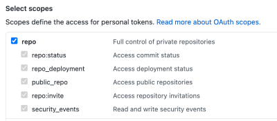
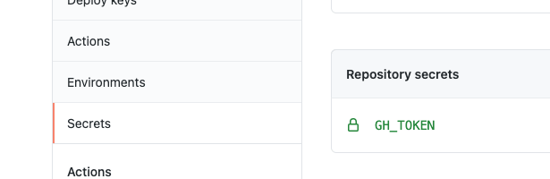

# 💖 This repo has x stars y forks

English | [简体中文](./README.zh-CN.md)

## How to trigger?

3 trigger methods are used here

1. push main branch trigger
2. fork trigger
3. It is triggered at a time of 10 minutes. Since GitHub Actions has restrictions on the timing of the trigger, it is not recommended to be smaller

## How to use it in your own project?

1. Fork into your own project
2. Open your own project’s Actions. For projects you fork by default, GitHub will close Actions by default
3. Apply for personal token, https://github.com/settings/tokens
4. Check the following figure

5. Save the newly created token to the Setting/Secrets of your project. Note that the token is saved

1. Modify `GH_TOKEN` in `.github/workflows/auto-update.yml` to keep this name consistent with the newly add
2. Actions will run automatically and update the name of the current project

## Inspired by

- https://github.com/RealPeha

## LICENSE

[MIT](./LICENSE)
